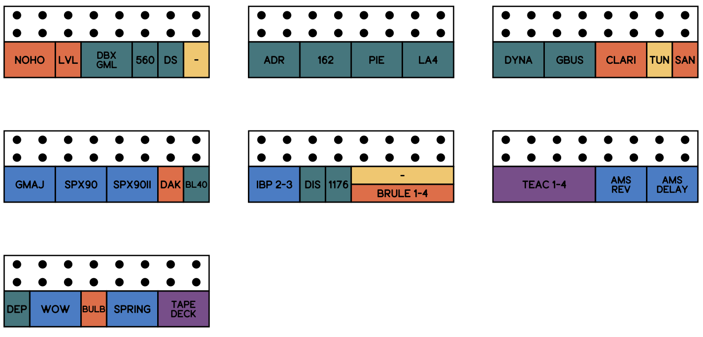
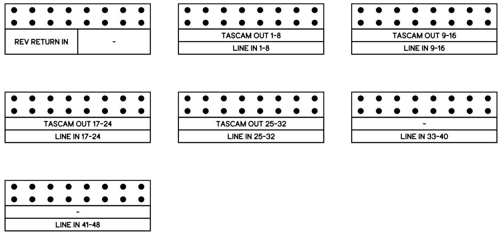

# TT Patchbay Label Generator

This repository contains two Python scripts for creating TT patchbay labels:

1. **TT_labels_BW.py**: Generates labels with a black-and-white theme.
2. **TT_labels_Color.py**: Generates labels with a colorful theme.

Both scripts produce a PDF file as the final output, making it easy to print high-quality labels for TT patchbays.

## Features

- Customizable label content.
- Black-and-white or colorful design options.
- High-resolution PDF output suitable for professional printing.

## Getting Started

### Prerequisites

- Python 3.7+
- Required libraries: `matplotlib`

Install the required libraries using pip:

```bash
pip install matplotlib
```

### Usage

1. Clone this repository:

```bash
git clone https://github.com/yourusername/tt-patchbay-label-generator.git
cd tt-patchbay-label-generator
```

2. Run one of the Python scripts:

   - For black-and-white labels:
     ```bash
     python TT_labels_BW.py
     ```

   - For colorful labels:
     ```bash
     python TT_labels_Color.py
     ```

3. The output PDF will be saved in the same directory as the script.

## Output Example

Below is an example of the generated PDF output:





## Customization

To customize the labels, edit the content and layout settings directly in the respective Python script. The key variables to modify are commented in the scripts for easy identification.

## Contributing

Contributions are welcome! Please open an issue or submit a pull request with any improvements or bug fixes.

## License

This project is licensed under the MIT License. See the [LICENSE](LICENSE) file for details.

---

Happy labeling!
